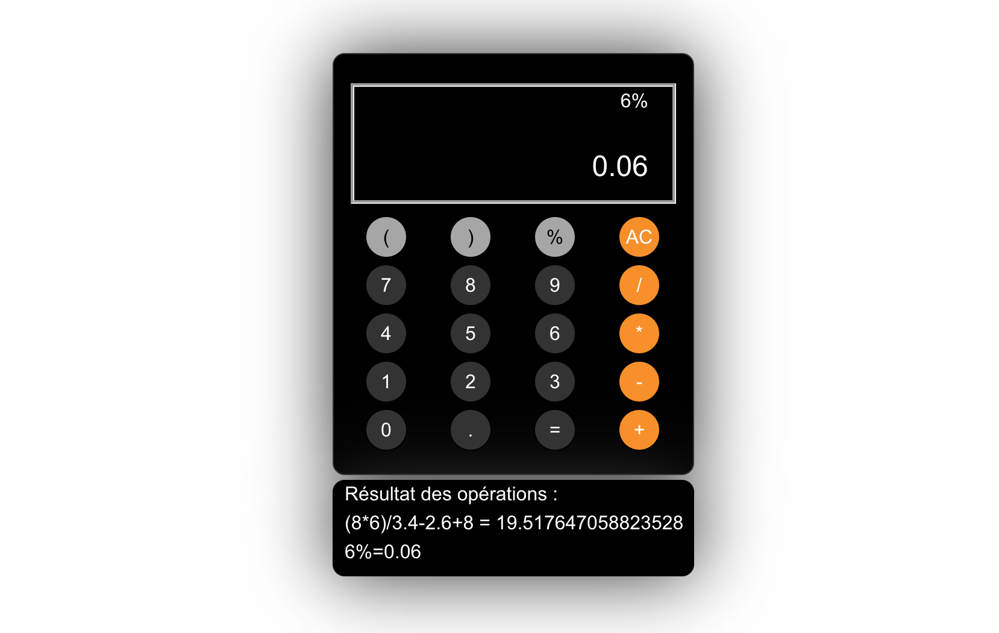

# Calculator

* Solo project made by me: [Joelle Everaert](https://github.com/Joelle-Everaert) :blush:

* 18.11.2020

## What is this ?
Build a simple calculator using javascript. 

## Context  

During my Web Dev training at **[BeCode](https://becode.org)**

## Purpose?
Put into practice our knowledge learned during the training course.

## Languages used?
* Html (just for the tag script)
* CSS
* Javascript

## Overview :collision:
*Click on the picture* :wink:

### Original instruction

> [Link]()

